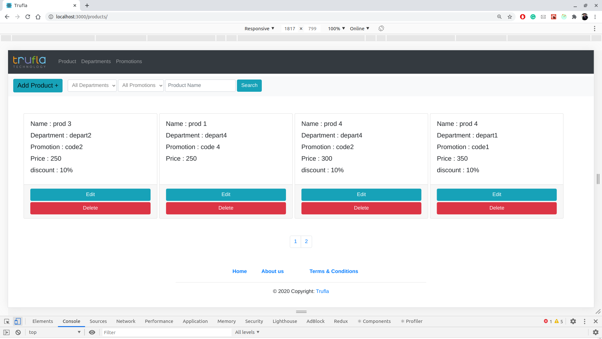
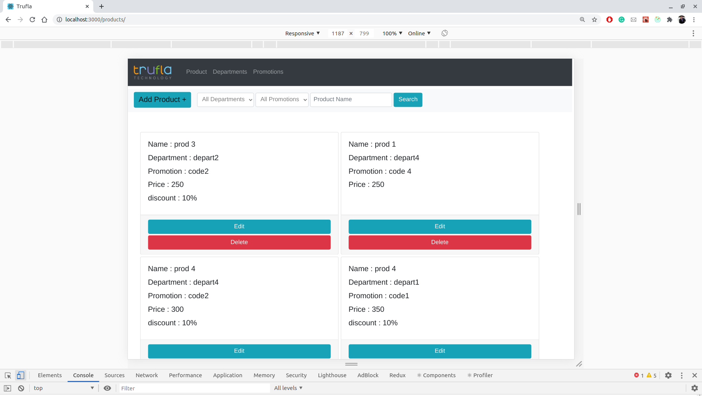
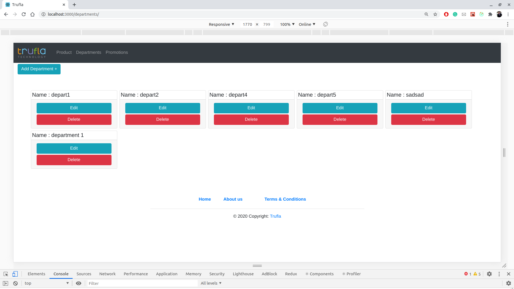
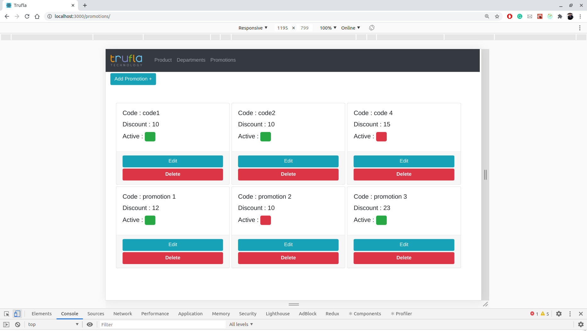
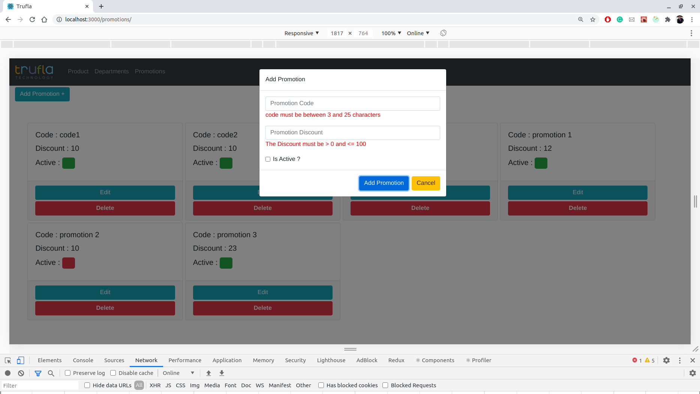

# Trufla Challenge
* This is a Store Site that you can control in your product, department and promotion 
* This site is developed in node.js(Express), mongoDB and React(Redux & Hooks)

# before running the code
* you can use local mongo database but check on my database name in ./config/keysDev.js
if you have the same name in your databases please change the name in my keys.js file from "restaurant" to another one.
* if you want to use my online database you can comment the line in keys.js file and uncomment the next line.

## You Can Do... 
* View all Products, Departments and Promotions.
* Add new Product, Department and Promotion.
* Delete an existing Product, Department and Promotion.

## Install
* you must have nodejs on your machine and you can install it [nodejs](https://nodejs.org/en/download/).
* you must have mongoDB on your machine and you can install it [mongo](https://docs.mongodb.com/manual/installation/).

## Run the project
* 1 ) Download the project.
* 2 ) start mongoDB service.
* 3 ) Enter the project folder.
* 4 ) Run npm install from the command line to install package.json express dependencies. 
* 5 ) Run node . or node  index.js or npm start
* 6 ) Enter the ./client folder.
* 7 ) Run npm install from the command line to install package.json react dependencies. 
* 8 ) Run npm start
* 9 ) Enjoy.

## Run with docker-compose
* 1 ) Download the project.
* 1 ) Enter the project folder.
* 1 ) Run docker-compose -p trufla up

## Testing
* 1 ) You should have mocha on your machine.
* 2 ) For server side enter the project folder.
* 4 ) For client side enter the client folder.
* 3 ) Run npm test.

### photo of The Site

#### List Product 1

#### List Product 2

#### List Product 3

#### List Product 4

#### Add Product Modal

#### List Department 1

#### List Department 2

#### List Department 3

#### List Department 3

#### Add Department Modal

#### List Promotion 1

#### List Promotion 2

#### List Promotion 3

#### List Promotion 4

#### Add Promotion Modal

#### Clinet Test

